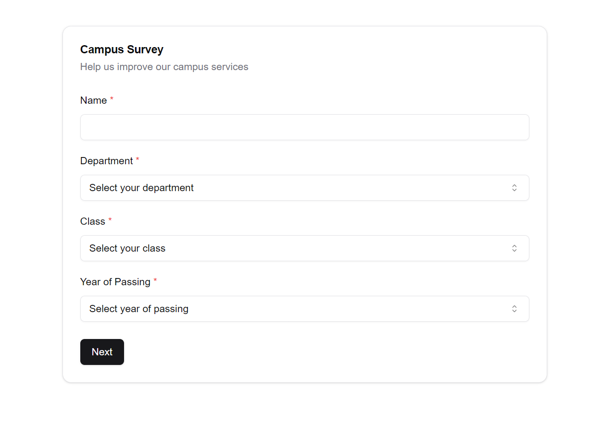

# Project Survey Website

This is a simple web application designed to collect survey information from college students. It is part of our final project, built to improve data collection and enhance campus services.

## Table of Contents

- [Project Survey Website](#project-survey-website)
  - [Table of Contents](#table-of-contents)
  - [Overview](#overview)
  - [Features](#features)
  - [Technologies Used](#technologies-used)
  - [Getting Started](#getting-started)
  - [Screenshots](#screenshots)
  - [Contributing](#contributing)
  - [License](#license)

## Overview

The **Project Survey Website** enables students to easily submit feedback and complete surveys about various campus services. The data collected will help shape improvements and better cater to the needs of the student body.

For more information on our final project, check out [Campus Services Management System](https://github.com/xditya/campusservicesmanagementsystem).

## Features

- Collect survey responses from students
- Simple and user-friendly interface
- Real-time form validation
- Stored responses for future analysis
- Secure and privacy-conscious design

## Technologies Used

- **Frontend**: React.js, Tailwind CSS
- **Database**: MongoDB

## Getting Started

To run this project locally, follow these steps:

1. Clone the repository:
   ```bash
   git clone https://github.com/xditya/project-survey.git
   ```
2. Install dependencies:
   ```bash
   npm install
   ```
3. Fill `env.local`:
   ```code
   MONGODB_URI=
   JWT_SECRET=
   ADMIN_USERNAME=
   ADMIN_PASSWORD=
   ```
4. Start the development server:
   ```bash
   npm run dev
   ```
5. Open the app in your browser at `http://localhost:3000`.

## Screenshots



_The landing page of the Project Survey Website._

## Contributing

We welcome contributions! If you'd like to contribute, please fork the repository and use a feature branch. Pull requests are warmly welcome.

## License

This project is licensed under the [MIT License](./LICENSE.md).
